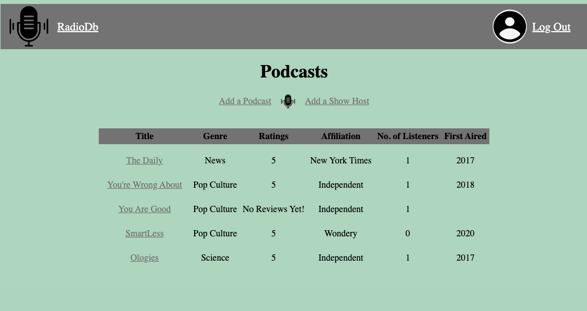
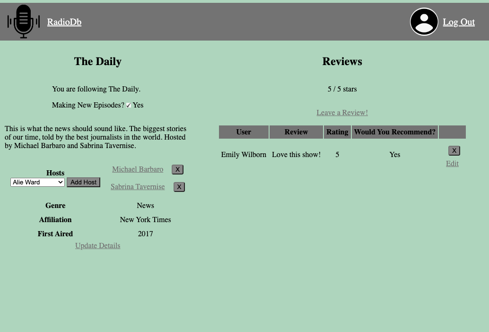
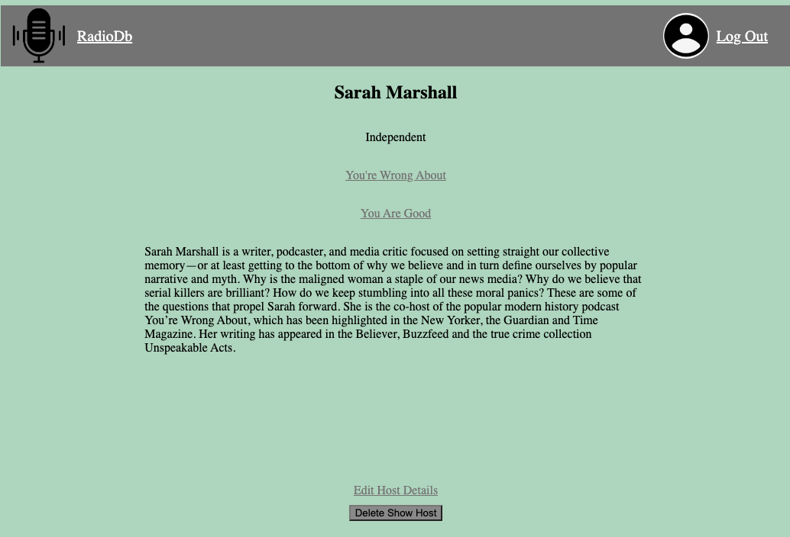
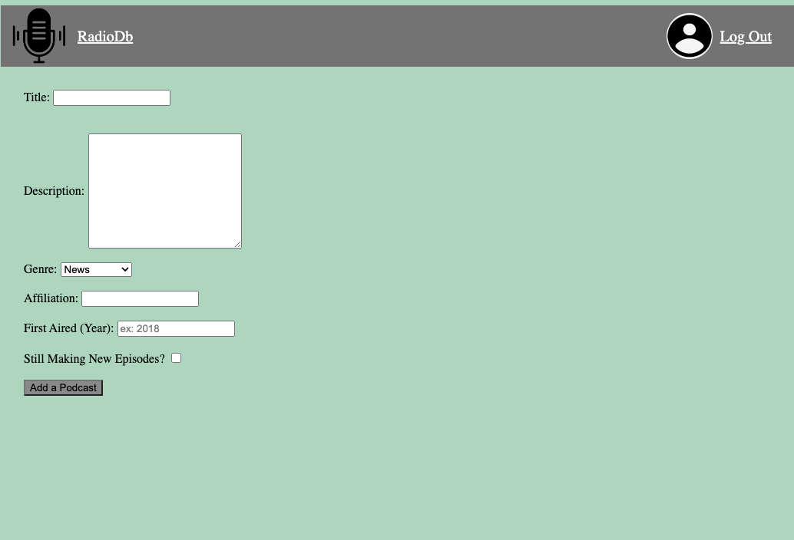

# RadioDb

A database for podcasts! Browse RadioDb to see what podcasts people are listening to and find new, fun podcasts to check out.

# Preview

View the list of podcasts in the database.

See all the information available on each podcast and leave a review.

View each host and what other podcasts they may host.

Login to add your other podcasts or hosts that aren't in the database.

## Technologies Used

•Express.js
•Node.js
•Mongodb
•JavaScript
•EJS
•HTML/CSS

# Getting Started

Check out RadioDB here:
https://long-pear-seahorse-suit.cyclic.app/podcasts

Login with google to be able to add and update your favorite podcasts.

# Next Steps

- Add in a sorting feature on the index so a user can sort based on genre or ratings
- Add a user page where the logged in user can view what podcasts they are following and what they recommend
- Add in a top podcasts chart based on the top ratings to see what everyone is listening to
